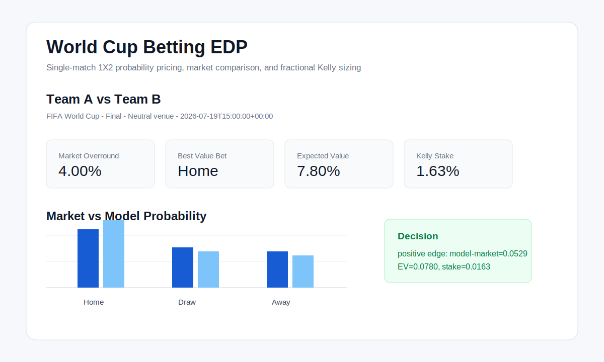
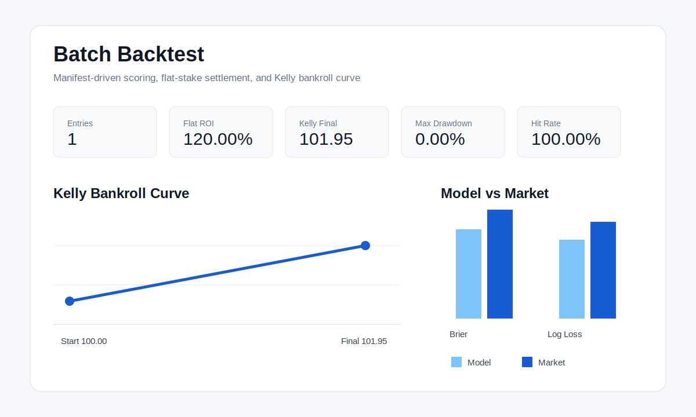

# World Cup Betting EDP

世界杯足球竞猜预测与 EDP 方法论研究项目。

本项目目标不是证明某个方法必然有效，而是建立一个可验证、可回测、可解释的世界杯竞猜概率定价系统：

- 估计比赛真实概率；
- 与市场赔率去水后的隐含概率比较；
- 只在模型概率、赔率、风险约束同时满足时标记 value bet；
- 用严格回测判断模型是否真的优于市场基准。

## Preview

Single-match probability pricing:



Batch backtest:



## Directory Layout

```text
worldcup-betting-edp/
├── README.md
├── AGENTS.md
├── PROJECT_STATUS.md
├── ROADMAP.md
├── TASKS.md
├── DECISIONS.md
├── DATA_SOURCES.md
├── MODEL_SPEC.md
├── BACKTEST_SPEC.md
├── pyproject.toml
├── data/
│   ├── raw/          # 原始下载数据，不手工改写
│   ├── processed/    # 清洗、标准化、可建模数据
│   └── external/     # 第三方公开数据快照和说明
├── notebooks/        # 探索性分析与模型试验
├── src/
│   └── worldcup_betting_edp/
│       ├── data/     # 数据抓取、读取、校验、版本化
│       ├── features/ # 特征工程：Elo、状态、赛程、市场信号
│       ├── models/   # 概率模型：market、Elo、Poisson、融合模型
│       ├── market/   # 赔率去水、盘口快照、市场概率
│       ├── betting/  # EV、value bet、Kelly、风险控制
│       ├── backtest/ # 时间切分、预测质量、资金曲线回测
│       └── reports/  # 报告生成脚本
├── configs/          # 数据源、模型参数、回测参数
├── tests/            # 单元测试与回归测试
└── reports/          # 研究报告、图表、阶段性结论
```

## First Report

第一阶段研究报告见：

```text
reports/initial_research_report.md
```

Current checkpoint status:

```text
PROJECT_STATUS.md
```

## Development

This project requires Python 3.10+. On this machine, use:

```bash
/opt/homebrew/bin/python3.12 --version
```

Run tests:

```bash
PYTHONPATH=src /opt/homebrew/bin/python3.12 -m unittest discover -s tests
```

Run the single-match MVP demo:

```bash
PYTHONPATH=src /opt/homebrew/bin/python3.12 examples/single_match_demo.py
```

Load the canonical JSON input example:

```bash
PYTHONPATH=src /opt/homebrew/bin/python3.12 - <<'PY'
from worldcup_betting_edp.data import load_prediction_input_path

payload = load_prediction_input_path("examples/demo_single_match.json")
print(payload.match.match_id)
print(payload.odds_snapshot.bookmaker)
print(payload.model_probabilities.model_name)
PY
```

Load the canonical settled-result example:

```bash
PYTHONPATH=src /opt/homebrew/bin/python3.12 - <<'PY'
from worldcup_betting_edp.data import load_settled_result_path

result = load_settled_result_path("examples/demo_settled_match.json")
print(result.match_id)
print(result.result_1x2)
print(result.to_outcome_vector())
PY
```

Score a prediction report against a settled result:

```bash
PYTHONPATH=src /opt/homebrew/bin/python3.12 - <<'PY'
from worldcup_betting_edp.backtest import score_prediction_report
from worldcup_betting_edp.data import load_prediction_input_path, load_settled_result_path
from worldcup_betting_edp.reports import evaluate_single_match

prediction_input = load_prediction_input_path("examples/demo_single_match.json")
settled_result = load_settled_result_path("examples/demo_settled_match.json")
report = evaluate_single_match(
    match=prediction_input.match,
    odds_snapshot=prediction_input.odds_snapshot,
    model_probabilities=prediction_input.model_probabilities,
)
print(score_prediction_report(report=report, settled_result=settled_result).to_dict())
PY
```

Settle the best value bet with a flat stake:

```bash
PYTHONPATH=src /opt/homebrew/bin/python3.12 - <<'PY'
from worldcup_betting_edp.backtest import settle_flat_stake
from worldcup_betting_edp.data import load_prediction_input_path, load_settled_result_path
from worldcup_betting_edp.reports import evaluate_single_match

prediction_input = load_prediction_input_path("examples/demo_single_match.json")
settled_result = load_settled_result_path("examples/demo_settled_match.json")
report = evaluate_single_match(
    match=prediction_input.match,
    odds_snapshot=prediction_input.odds_snapshot,
    model_probabilities=prediction_input.model_probabilities,
)
print(settle_flat_stake(report=report, settled_result=settled_result, stake=10.0).to_dict())
PY
```

Build a sequential Kelly bankroll curve:

```bash
PYTHONPATH=src /opt/homebrew/bin/python3.12 - <<'PY'
from worldcup_betting_edp.backtest import settle_kelly_bankroll
from worldcup_betting_edp.data import load_prediction_input_path, load_settled_result_path
from worldcup_betting_edp.reports import evaluate_single_match

prediction_input = load_prediction_input_path("examples/demo_single_match.json")
settled_result = load_settled_result_path("examples/demo_settled_match.json")
report = evaluate_single_match(
    match=prediction_input.match,
    odds_snapshot=prediction_input.odds_snapshot,
    model_probabilities=prediction_input.model_probabilities,
)
print(settle_kelly_bankroll([(report, settled_result)], starting_bankroll=100.0).to_dict())
PY
```

Load a batch backtest manifest:

```bash
PYTHONPATH=src /opt/homebrew/bin/python3.12 - <<'PY'
from worldcup_betting_edp.data import load_backtest_manifest_path

manifest = load_backtest_manifest_path("examples/demo_backtest_manifest.json")
print(manifest.to_dict())
PY
```

Load the downloaded martj42 international results snapshot:

```bash
PYTHONPATH=src /opt/homebrew/bin/python3.12 - <<'PY'
from worldcup_betting_edp.data import (
    filter_world_cup_results,
    load_martj42_results_path,
    summarize_results,
)

results = load_martj42_results_path("data/raw/martj42/results.csv")
world_cup = filter_world_cup_results(results)
print(summarize_results(results))
print({"world_cup_match_count": len(world_cup)})
PY
```

Load the processed canonical historical match table:

```bash
PYTHONPATH=src /opt/homebrew/bin/python3.12 - <<'PY'
from worldcup_betting_edp.data import load_canonical_matches_csv, summarize_canonical_matches

matches = load_canonical_matches_csv("data/processed/matches/canonical_matches.csv")
print(summarize_canonical_matches(matches))
print(matches[0].to_dict())
PY
```

Generate Elo history and current team ratings from the canonical table:

```bash
PYTHONPATH=src /opt/homebrew/bin/python3.12 - <<'PY'
from worldcup_betting_edp.data import load_canonical_matches_csv
from worldcup_betting_edp.models import (
    build_elo_rating_history,
    current_elo_table,
    write_current_elo_ratings_csv,
    write_elo_rating_history_csv,
)

matches = load_canonical_matches_csv("data/processed/matches/canonical_matches.csv")
history = build_elo_rating_history(matches)
current = current_elo_table(history)
write_elo_rating_history_csv(history, "data/processed/ratings/elo_history.csv")
write_current_elo_ratings_csv(current, "data/processed/ratings/current_elo_ratings.csv")
print(current[:5])
PY
```

Run a batch backtest manifest from Python:

```bash
PYTHONPATH=src /opt/homebrew/bin/python3.12 - <<'PY'
from worldcup_betting_edp.backtest import run_batch_backtest_path

result = run_batch_backtest_path(
    "examples/demo_backtest_manifest.json",
    flat_stake=10.0,
    starting_bankroll=100.0,
)
print(result.summary())
PY
```

Run the CLI prediction command from source:

```bash
PYTHONPATH=src /opt/homebrew/bin/python3.12 -m worldcup_betting_edp.cli \
  --input examples/demo_single_match.json
```

Run the CLI batch backtest command from source:

```bash
PYTHONPATH=src /opt/homebrew/bin/python3.12 -m worldcup_betting_edp.cli \
  --manifest examples/demo_backtest_manifest.json \
  --flat-stake 10 \
  --starting-bankroll 100
```

Save the batch backtest result to a report file:

```bash
PYTHONPATH=src /opt/homebrew/bin/python3.12 -m worldcup_betting_edp.cli \
  --manifest examples/demo_backtest_manifest.json \
  --flat-stake 10 \
  --starting-bankroll 100 \
  --output reports/demo_backtest_result.json
```

Output CSV instead of JSON:

```bash
PYTHONPATH=src /opt/homebrew/bin/python3.12 -m worldcup_betting_edp.cli \
  --input examples/demo_single_match.json \
  --format csv
```

After installing the package, the console script is:

```bash
worldcup-edp-predict --input examples/demo_single_match.json
worldcup-edp-predict --manifest examples/demo_backtest_manifest.json
```

Run the local Streamlit dashboard:

```bash
/opt/homebrew/bin/python3.12 -m venv .venv
. .venv/bin/activate
python -m pip install -e ".[ui]"
streamlit run apps/streamlit_app.py
```

The dashboard uses English-first bilingual labels, for example `Market Odds / 市场赔率`.
It can also load a one-match prediction file through `Upload JSON / 上传JSON`.
Use the sidebar `Mode / 模式` control to switch between single-match pricing and batch backtesting.
